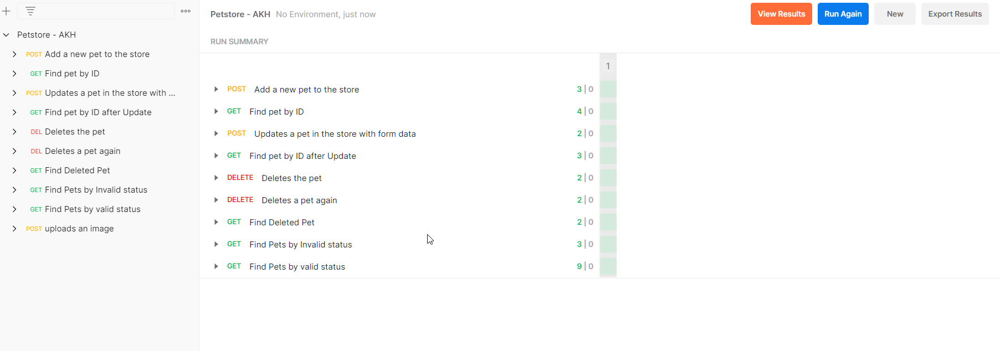

# SampleTestingFramework

Selenium WebDriver framework containing tests for Login & Products page for
https://www.saucedemo.com/

## Pre requisites for running tests in command line:

- Java 8
- Maven 3.6.3
- Chrome driver. Download from https://chromedriver.chromium.org/downloads. Save chromedriver.exe in c:\webdrivers\ or
  change this path which is hard coded
  in https://github.com/OneComQAAssignment/SampleTestingFramework/blob/main/src/main/java/com/one/framework/WebDriverFactory.java

Run 'mvn clean install -DskipTests' to build the project

## Run tests

In target folder run (for Windows):

java -cp PocForOneCom-1.0-SNAPSHOT-tests.jar;PocForOneCom-1.0-SNAPSHOT.jar;libs\*
-Dwebdriver.baseUrl=https://www.saucedemo.com/ -Dwebdriver.remote=false -Dwebdriver.capabilities.browserName=chrome
org.testng.TestNG ../TestNG-XML-Suites/Login/LoginTestSuite.xml

java -cp PocForOneCom-1.0-SNAPSHOT-tests.jar;PocForOneCom-1.0-SNAPSHOT.jar;libs\*
-Dwebdriver.baseUrl=https://www.saucedemo.com/ -Dwebdriver.remote=false -Dwebdriver.capabilities.browserName=chrome
org.testng.TestNG ../TestNG-XML-Suites/Smoke/SmokeTestSuite.xml

##Postman Collection
Postman collection is available here : (/PostmanCollection)

Import the collection in Postman and use the collection runner to run the entire collection.

Scope :
All PET API endpoints

##Updated on the current project
- Fixed login tests and all are passing.
- Added sorting tests for main page.
- Added new class file and test for add to cart.

